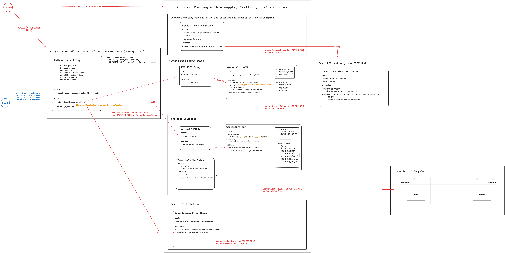

# Genesis Contracts

Smart contracts for [Champions Tactics™ Grimoria Chronicles](https://championstactics.ubisoft.com/) written in [Solidity](https://soliditylang.org/).

Champions Tactics™ Grimoria Chronicles is a PVP Tactical RPG game on PC by Ubisoft. Assemble a team of mythical Champions and craft you legend in the dark and mystical world of Grimoria.

## Architecture

For a global overview of the contracts, refer to the diagram below




## Security

`GenesisPFP` is deployed on Ethereum mainnet at address `0xE841e6e68BECFC54b621A23a41f8C1a829a4cf44` and has been audited by KALOS. The report can be found [here](<./audit/[KALOS] Ubisoft Genesis PFP Audit Report v1.0 (ENG).pdf>).

`GenesisChampionFactory`, `GenesisChampion`, `GenesisMinter`, `GenesisCrafter`, `GenesisRewardsDistributor`, `GenesisCrafterRule` have not yet been deployed.

`AuthenticatedRelay` is our global entrypoint for all mint operations on any EVM chain, it's hasn't been deployed yet.

### Slither reports

- [Checklist report can be found here](./slither-report-checklist.md)
- [Human summary report can be found here](./slither-report-human-summary.md)

## Installation

### From source

1. Install [Foundry](https://book.getfoundry.sh/getting-started/installation)
2. Clone this repository
3. Initialize the submodules

```bash
# when switching branch, it's recommended to deinit the submodules first with: 
# git submodule deinit --force .
git submodule update --init --recursive
```
4. Install external dependencies for `lib/authenticated-relay` (see [README.md](./lib/authenticated-relay/README.md))
```
cd lib/authenticated-relay
forge install
# build sequence contracts dependencies:
pushd lib/contracts-library
yarn && yarn build
popd
```
5. Install node dependencies: `npm install` 

## Contract documentation

Contract documentation is auto-generated using `forge doc`.

`forge doc -s` allows you to serve it locally at [localhost:3000](http://localhost:3000).

## Build, test and deploy

### Build

```bash
forge build
```

### Test

```bash
forge clean && forge test --ffi --force --summary --detailed
```

> [GenesisCrafter](./src/GenesisCrafter.sol) and [GenesisMinter](./src/GenesisMinter.sol) use [openzeppelin-foundry-upgrades](https://github.com/OpenZeppelin/openzeppelin-foundry-upgrades) to make safety checks before upgrading proxy implementations, we need to use the `--ffi` flag that will run external processes (i.e. shell scripts) from Solidity code.

### Deploy

**Deploying Locally**

1. Start a local testnet using [anvil](https://book.getfoundry.sh/anvil/) or any local testnet client
2. In another terminal, setup the required env variables and run `forge create` to deploy the contract as below

> Use the `--unlocked` flag with Anvil's first test account used as sender with `ETH_FROM`

For GenesisPFP

```bash
export ETH_FROM="0xf39Fd6e51aad88F6F4ce6aB8827279cffFb92266"
export MINTER_ADDRESS="0x..."
export VAULT_ADDRESS="0x..."
export LINK_ADDRESS="0x0000000000000000000000000000000000000000"
export VRF_WRAPPER_ADDRESS="0x0000000000000000000000000000000000000000"
export RPC_URL="http://localhost:8545" # Anvil local RPC

forge create                                    \
    --rpc-url $RPC_URL --unlocked               \
    src/GenesisPFP.sol:GenesisPFP               \
    --constructor-args "Genesis PFP" "PFP" "1"  \
        $MINTER_ADDRESS $VAULT_ADDRESS          \
        $LINK_ADDRESS $VRF_WRAPPER_ADDRESS
```

```bash
source ./script/GenesisChampionFactory/anvil.env
forge script script/GenesisChampionFactory/Deploy.s.sol --sig "deploy()" --rpc-url http://localhost:8545 --broadcast

# GenesisChampionFactory deployed at 0x5FbDB2315678afecb367f032d93F642f64180aa3
✅  [Success]Hash: 0x5fc8eb0e8498bf7c5dae6f6884a27a1c7d083288b28878f2062dc7e3f8784165
Contract Address: 0x5FbDB2315678afecb367f032d93F642f64180aa3
Block: 1
Paid: 0.016042904 ETH (4010726 gas * 4 gwei)

# GenesisChampion implementation deployed using `GenesisChampionFactory.deploy()`
✅  [Success]Hash: 0x9da0f622ce953256f5d0bddac9849bfd6b0baf78785bfef7aa4ccb385894777d
Block: 2
Paid: 0.011808357309540703 ETH (3021259 gas * 3.908422717 gwei)

# Implementation address can be called using cast
cast call 0x5fbdb2315678afecb367f032d93f642f64180aa3 "getLatestDeployment()"
0x000000000000000000000000a16e02e87b7454126e5e10d957a927a7f5b5d2be
```

**Deploy on a public network (GenesisPFP)**

We use the Sepolia testnet to deploy and test our contracts in dev environment.

Chainlink's VRF configuration for Sepolia can be found [here](https://docs.chain.link/resources/link-token-contracts#sepolia-testnet).

Deployment parameters are listed below in the same order as the contract constructor takes them:

| Parameter      | Value                                                 |
| -------------- | ----------------------------------------------------- |
| Name           | GenesisPFP                                            |
| Symbol         | PFP                                                   |
| Version        | 1                                                     |
| Minter address | Address granted with MINTER_ROLE on contract creation |
| Vault address  | Address receiving marketplace royalties               |
| LINK Token     | 0x779877A7B0D9E8603169DdbD7836e478b4624789            |
| VRF Wrapper    | 0xab18414CD93297B0d12ac29E63Ca20f515b3DB46            |

You will need to provide a mnemonic phrase, private key, ledger or any wallet solution to deploy your contract on a live network. Please refer to Foundry's documentation for options.

To deploy the contracts on Sepolia, run the following command (replace `$RPC_URL` with a valid Sepolia RPC endpoint):

```bash
$forge create                                    \
    --rpc-url $RPC_URL                  \
    src/GenesisPFP.sol:GenesisPFP               \
    --constructor-args "Genesis PFP" "PFP" "1"  \
        $MINTER_ADDRESS $VAULT_ADDRESS          \
        $LINK_ADDRESS $VRF_WRAPPER_ADDRESS
```

## Authors

- Nicolas LAW YIM WAN
- Louis GAROCHE

## License

This project is available under the [Apache 2.0 License](./LICENSE.md)
